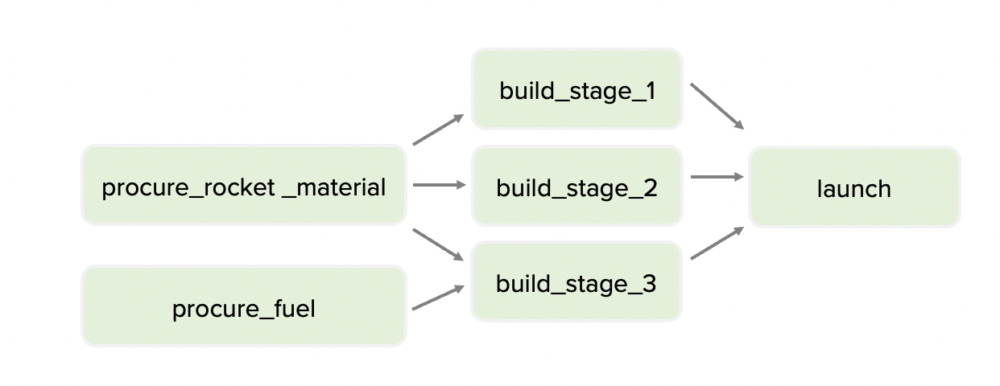

# Exercise 1 - Create a DAG to launch a rocket

- Use the `EmptyOperator`
- Import: `from airflow.operators.empty import EmptyOperator`

Implement the following DAG

# Exercise 2 - Adding some scheduling

- Use the code from Exercise 1
- Create the following schedule intervals:
  - At 13:45 every Mon/Wed/Fri
  - Every 3 days
- Starting 90 days ago

- When to use cron or timedelta?

# Exercise 3 - Let's try using Context

- Use the code from the Hello World exercise
- Echo the following messages with a bash operator:
  - “[task] is running in the [dag] pipeline”
- Print the following messages with a python operator:
  - “This DAG run was for period [interval_start] to [interval_end]” 
  - “This DAG run was triggered on [date]”

