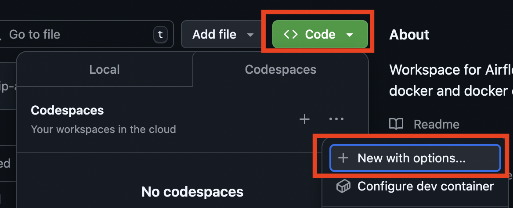
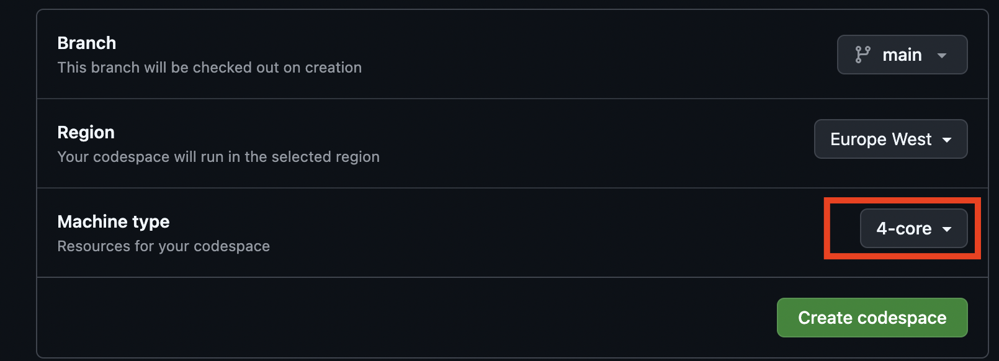
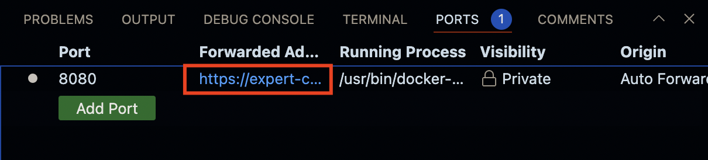
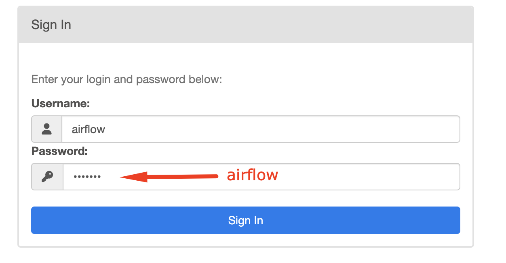

# Codespaces Airflow training environment

This repository contains the code for the Airflow training environment.

## Getting started

1. On the repository page in Github, select "Code" and "New with options..."

    

1. Ensure that you select "4-core" and select "Create codespace"

    

1. Check that you have enough memory allocated to your codespaces instance. In the terminal (ctrl + ` ) check that you have more than 4GB of allocated memory:

    ```
    docker run --rm "debian:bullseye-slim" bash -c 'numfmt --to iec $(echo $(($(getconf _PHYS_PAGES) * $(getconf PAGE_SIZE))))'
    ```

1. Start all services:
    ```
    docker compose up
    ```

1. The Airflow web UI will available at: http://localhost:8080.  To access this in the workspace, you will need to make use of a forwarded address.  This can be accessed under "PORTS"

    1. Press "ctrl+shift+P" -> Type "ports" -> Select "Ports: Focus on Ports View"
    1. Select the link under "Forwarded Address"

    


4. Login to Airflow:



