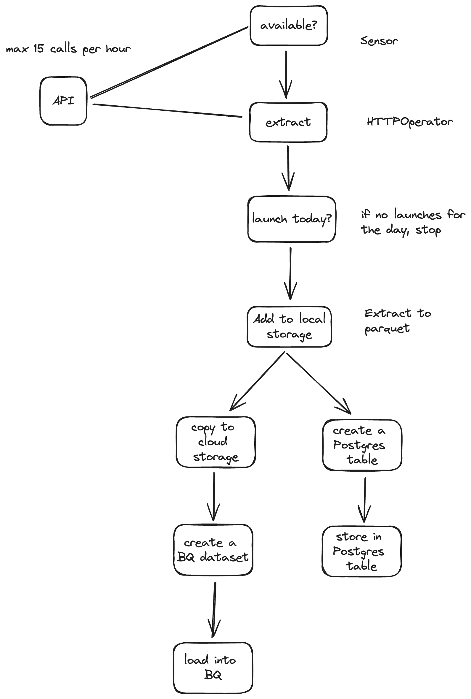

You're a rocket scientist at DeepSpace Technologies. Your boss assigns you to create a data pipeline using Apache Airflow to track global rocket launches from the last 60 days and future launches via The SpaceDevs API.
https://lldev.thespacedevs.com/2.2.0/launch 

Your expertise makes you the right person for this task. The pipeline will collect and process launch data, providing insights on rocket IDs, mission names, statuses, countries, and launch providers.

You need to build an operator to check for launches scheduled for today. If there are none, the pipeline will stop to avoid processing outdated data. You plan to store the extracted data in parquet files for efficient access.

Key questions remain:
- How to ensure the API is operational?
- How to pass API responses to the pipeline?
- Is local storage necessary?
- How to request data for a specific date?

Your boss suggests using secure cloud storage for the organized data and integrating the pipeline with BigQuery for advanced analytics. Additionally, she proposes an optional PostgreSQL database for team members who prefer it.

You scribble down a diagram to help understand what's needed:

As you finalize the project, you appreciate your boss's guidance. You've developed a robust data pipeline that enhances the understanding of rocket launches worldwide, pushing the limits of space exploration.

Good luck! 
To infinity... and beyond! 